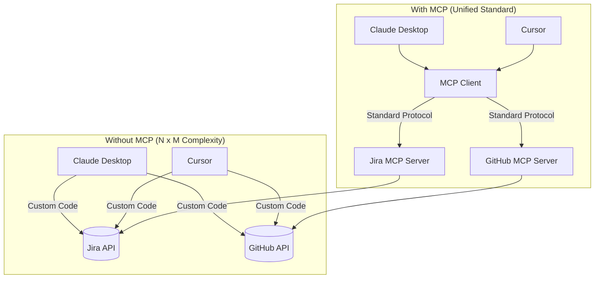
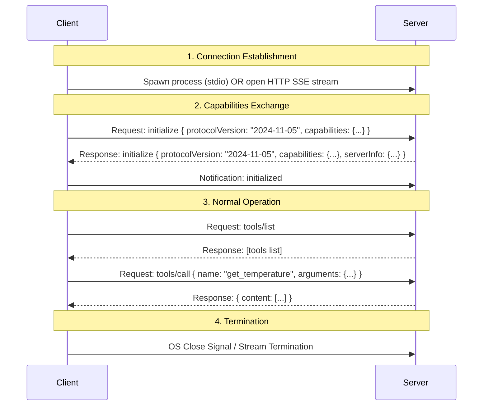

# The Ultimate Guide to Model Context Protocol (MCP)

Welcome to the comprehensive developer's guide and complete tutorial for the **Model Context Protocol (MCP)**. This document covers everything from core theory to low-level transport protocols (`stdio` vs. `SSE`), wire-level message formats, security models, and step-by-step practical implementations.

---

## Table of Contents
1. [Executive Summary & The "Why"](#1-executive-summary--the-why)
2. [Core Glossary & Definitions](#2-core-glossary--definitions)
3. [Core Architecture: Host vs. Client vs. Server](#3-core-architecture-host-vs-client-vs-server)
4. [The Three Pillars of MCP](#4-the-three-pillars-of-mcp)
   - [Tools (Actions)](#tools-actions)
   - [Resources (Data Sources)](#resources-data-sources)
   - [Prompts (Templates)](#prompts-templates)
5. [Deep Dive: Transport Layers (stdio vs. SSE)](#5-deep-dive-transport-layers-stdio-vs-sse)
   - [stdio Protocol Plumbing](#stdio-protocol-plumbing)
   - [SSE Protocol Plumbing](#sse-protocol-plumbing)
   - [Comparison Matrix](#comparison-matrix)
6. [Wire Protocol: JSON-RPC 2.0 & Wire Formats](#6-wire-protocol-json-rpc-20--wire-formats)
7. [Session Lifecycle & Handshake Flow](#7-session-lifecycle--handshake-flow)
8. [Security & Sandboxing Model](#8-security--sandboxing-model)
9. [Step-by-Step Implementation Guides & Code Explanations](#9-step-by-step-implementation-guides--code-explanations)
10. [Debugging & Testing (MCP Inspector)](#10-debugging--testing-mcp-inspector)
11. [Best Practices & Design Patterns](#11-best-practices--design-patterns)

---

## 1. Executive Summary & The "Why"

### The Problem: The N×M Integration Nightmare
Historically, connecting Large Language Models (LLMs) to external tools and data sources required bespoke integration layers. 
* If you had **N** different AI applications (Cursor, Claude Desktop, custom web apps) and **M** different data sources/tools (GitHub, Slack, Databases, Local Filesystem), you needed to write custom integration code **N × M** times.
* Developers had to manually translate raw APIs (REST, GraphQL, gRPC) into schemas the LLM could parse, handle authentication individually, and manage rate limits on a case-by-case basis.

### The Solution: MCP
The **Model Context Protocol (MCP)**, open-sourced by Anthropic, acts as an open standard (like USB-C for AI). It decouples the AI applications (Clients/Hosts) from the data sources and tools (Servers).



By standardizing how capabilities are described and executed, any MCP-compliant AI client can immediately discover and use tools provided by any MCP-compliant server.

---

## 2. Core Glossary & Definitions

Before looking at the technical architecture, here are the official definitions of the key terms used throughout the Model Context Protocol:

* **Host**: The user-facing container application (e.g. Claude Desktop, Cursor, VS Code) that orchestrates sessions, runs the core LLM execution loop, and displays outputs to the user.
* **Client**: The internal engine within the Host implementing the MCP specification. It handles connection parameters, manages active server sessions, translates LLM intents into tool calls, and passes responses back to the model.
* **Server**: A lightweight, standalone process or web service that exposes custom tools, read-only resources, and prompt templates to the client. It is LLM-independent.
* **Tool**: An executable action exposed by the server (e.g., executing a command or writing a file). Tools have schemas defining parameters and descriptions.
* **Resource**: Read-only context (such as database schemas, logs, or static configuration files) identified by unique URIs that the server makes accessible to the LLM.
* **Prompt**: Reusable instruction templates or system configurations that servers declare to guide user queries (similar to slash commands).
* **Transport Layer**: The serialization and connection plumbing used to send JSON-RPC 2.0 frames between client and server. Standard layers include `stdio` (Standard I/O) and `SSE` (Server-Sent Events).
* **JSON-RPC 2.0**: The lightweight, stateless remote procedure call protocol encoding format used by MCP.
* **Handshake (Initialization)**: The startup exchange where the client and server confirm protocol version compatibility and advertise capabilities.

---

## 3. Core Architecture: Host vs. Client vs. Server

MCP divides responsibilities into three distinct roles:

```text
+-------------------------------------------------------+
|                       HOST                            |
|  (User Interface: Cursor, Claude Desktop, Custom UI)  |
|                                                       |
|  +-------------------------------------------------+  |
|  |                   CLIENT                        |  |
|  |  (Manages connections, calls tools, sessions)  |  |
|  +-------------------------------------------------+  |
+--------------------------|----------------------------+
                           |
                MCP Protocol (stdio/SSE)
                           |
+--------------------------v----------------------------+
|                     SERVER                            |
|  (Exposes Tools, Resources, and Prompt templates)     |
+-------------------------------------------------------+
```

### 1. The Host
The **Host** is the user-facing container application. It manages the user interface, renders chat inputs, and contains the core LLM execution engine.
* **Examples**: VS Code, Cursor, Claude Desktop, a command-line terminal, or a custom Django/React web application.

### 2. The Client
The **Client** is the engine inside the Host that implements the MCP specification. 
* It initiates connections to MCP servers.
* It parses tool/resource schemas returned by the servers.
* It translates LLM intents into protocol requests and returns the server's response back to the LLM.

### 3. The Server
The **Server** is a lightweight, specialized process or service that exposes specific capabilities (tools, data resources, or prompt templates) to the client.
* **Characteristics**: The server has no direct dependency on the LLM. It does not need to know which LLM (Gemini, Claude, GPT-4) is calling it; it simply implements standard interfaces to run code or fetch data.

---

## 4. The Three Pillars of MCP

MCP defines three primary primitives that a server can expose: **Tools**, **Resources**, and **Prompts**.

| Feature | Description | Initiator | Example Use Case |
| :--- | :--- | :--- | :--- |
| **Tools** | Executable actions that let the LLM modify state or run calculations. | LLM / Client | Writing a file, running a database query, sending an email. |
| **Resources** | Read-only data sources or contexts that feed information to the LLM. | Client / LLM | Reading a config file, exposing git diffs, tailing server logs. |
| **Prompts** | Pre-structured templates or workflows exposed to the user. | User / Host | "Review this code", "Debug this error", "Write a git commit message". |

---

### Tools (Actions)
Tools represent **executable code** that can change system state or perform operations.
* **Execution flow**:
  1. The server exposes the tool's schema (name, description, parameter types).
  2. The LLM decides to call the tool and generates the arguments.
  3. The client sends a `tools/call` request to the server.
  4. The server runs the actual function and returns the results (text, images, or files).

> [!IMPORTANT]
> **Docstrings and Type Hints Matter:** LLMs rely heavily on the description and parameter names to determine when a tool is relevant. A well-written docstring directly influences tool-selection accuracy.

---

### Resources (Data Sources)
Resources are **read-only pieces of data** that the server makes available to the client. They are identified by URIs.
* **Static Resources**: Hardcoded locations (e.g., `file:///etc/config.json`).
* **Dynamic Resource Templates**: Parametrized URIs (e.g., `database://{table}/schema`). The client can resolve these dynamically.
* **Mime Types**: Resources include MIME types (e.g., `text/plain`, `application/json`, `image/png`) to tell the client how to handle and display the data.

---

### Prompts (Templates)
Prompts are **reusable instructions or templates** that guide the LLM's behavior.
* A server can declare prompts that users can trigger inside the client UI.
* Prompts can accept arguments (e.g., a prompt called `refactor-code` taking a `language` argument).
* They allow servers to package recommended system prompts alongside the tools they provide.

---

## 5. Deep Dive: Transport Layers (stdio vs. SSE)

Transport determines how the serialized JSON-RPC 2.0 messages are physically framed and sent between the Client and Server. MCP supports two core transport modes out of the box.

---

### stdio Protocol Plumbing
The standard input/output (`stdio`) transport is designed for **co-located processes** running on the same machine. 

```text
+-----------------------+                    +-----------------------+
|      MCP Client       |                    |      MCP Server       |
|                       |                    | (Spawned Child Process|
|  +-----------------+  |                    |  +-----------------+  |
|  | Writing Process |=======(Standard Input)======> Reading Loop     |  |
|  +-----------------+  |                    |  +-----------------+  |
|                       |                    |                       |
|  +-----------------+  |                    |  +-----------------+  |
|  | Reading Loop    |<======(Standard Output)=====| Writing Process |  |
|  +-----------------+  |                    |  +-----------------+  |
|                       |                    |                       |
|  +-----------------+  |                    |  +-----------------+  |
|  | Log Handler     |<======(Standard Error)======| stderr Logging  |  |
|  +-----------------+  |                    |  +-----------------+  |
+-----------------------+                    +-----------------------+
```

#### Under the Hood:
1. **Process Lifecycle**: The Host process uses OS primitives (like `subprocess.Popen` in Python or `child_process.spawn` in Node.js) to start the MCP Server binary.
2. **Channel Separation**:
   * **`stdin` (Standard Input)**: The client writes JSON-RPC requests here. The server runs a continuous listening loop reading line-by-line.
   * **`stdout` (Standard Output)**: The server writes JSON-RPC responses here. The client reads from this stream.
   * **`stderr` (Standard Error)**: Reservably separate from the protocol channel. Anything printed to `stderr` by the server is intercepted by the client and logged for debugging (not parsed as JSON-RPC). This prevents simple runtime warnings or `print()` debug outputs from crashing the parser.

---

### SSE Protocol Plumbing
Server-Sent Events (`SSE`) is a standard HTTP transport designed for **networked and cloud-native** deployments.

Unlike standard HTTP (which is request-response only) or WebSockets (which are full-duplex TCP tunnels), SSE provides an **asymmetric, fire-and-forget channel layout**:

```text
+-----------------------+                            +-----------------------+
|      MCP Client       |                            |      MCP Server       |
|                       |                            |    (Web Service)      |
|  +-----------------+  |                            |  +-----------------+  |
|  | HTTP POST Client|=== (HTTP POST: Client Messages) => HTTP Endpoints  |  |
|  +-----------------+  |                            |  +-----------------+  |
|                       |                            |                       |
|  +-----------------+  |                            |  +-----------------+  |
|  | SSE Event Stream|<=== (Server-Sent Event Stream) ===| SSE Stream Engine |  |
|  +-----------------+  |                            |  +-----------------+  |
+-----------------------+                            +-----------------------+
```

#### Under the Hood:
1. **Handshake (SSE Setup)**:
   * The client initiates a standard HTTP `GET` request to the server's SSE endpoint (typically `/sse`).
   * The server responds with headers setting `Content-Type: text/event-stream` and `Cache-Control: no-cache`. It keeps this TCP socket open indefinitely.
2. **Server-to-Client Communication**:
   * The server pushes messages to the client down the open SSE stream. Each message is formatted with the prefix `data: ` followed by the JSON payload, followed by double newlines (`\n\n`).
3. **Client-to-Server Communication**:
   * Because SSE is strictly **unidirectional (server to client)**, the client cannot write messages back down the SSE channel.
   * Instead, the client transmits JSON-RPC requests to the server via standard **HTTP POST** requests to a dedicated endpoint (such as `/message` or as indicated by the server during the SSE handshake).

---

### Comparison Matrix

| Aspect | `stdio` Transport | `SSE` Transport |
| :--- | :--- | :--- |
| **Network Location** | Local (same machine) | Remote (across local networks or internet) |
| **Setup Cost** | Extremely low (single file or child process execution) | Medium (requires HTTP server framework, ports, domain names) |
| **Communication Type** | Bidirectional process streams (`stdin`/`stdout`) | Asymmetric HTTP (unidirectional SSE stream + HTTP POST requests) |
| **Ports & Binding** | No ports required (safest for local use) | Binds to an HTTP port (e.g. `8000`) |
| **Concurrency** | 1 Host to 1 Server process | Multiple Clients can connect to 1 remote server |
| **Debugging** | Easy (directly pipe stdin/stdout) | Harder (requires monitoring HTTP packages and streams) |
| **Best Used For** | Desktop environments (e.g., Cursor, Claude Desktop) | Multi-tenant services, cloud database engines, hosted APIs |

---

## 6. Wire Protocol: JSON-RPC 2.0 & Wire Formats

All communication over MCP transports conforms to the **JSON-RPC 2.0 specification**.

### 1. Request Frame (Client to Server)
Sent when the client wants to execute a command (e.g., listing tools).
```json
{
  "jsonrpc": "2.0",
  "id": 1,
  "method": "tools/list",
  "params": {}
}
```

### 2. Response Frame (Server to Client)
Sent by the server to return the result of a request.
```json
{
  "jsonrpc": "2.0",
  "id": 1,
  "result": {
    "tools": [
      {
        "name": "get_temperature",
        "description": "Fetch the current temperature for a given city.",
        "inputSchema": {
          "type": "object",
          "properties": {
            "city": {
              "type": "string"
            }
          },
          "required": ["city"]
        }
      }
    ]
  }
}
```

### 3. Notification Frame (One-Way)
Used for asynchronous events that do not expect a response.
```json
{
  "jsonrpc": "2.0",
  "method": "notifications/resources/list_changed"
}
```

---

## 7. Session Lifecycle & Handshake Flow

Before tools can be executed, the client and server must complete an initialization handshake.



---

## 8. Security & Sandboxing Model

Because MCP servers execute local code and access data, they represent a significant security surface area.

### Core Security Policies:
1. **Client Isolation**: The AI model (LLM) does not speak to the server. The client intercepts the model's intents, runs authorization checks, and then executes the code.
2. **Credential Management**: Servers should never contain hardcoded API keys. They should receive secrets dynamically via environment variables (`.env`) passed down by the client during process initialization.
3. **Execution Sandboxing**: For untrusted tools, execute within isolated Docker containers or WebAssembly runtimes rather than host environments.

---

## 9. Step-by-Step Implementation Guides & Code Explanations

This section breaks down the **actual code** present in this repository, showing how the local calculator server and the Gemini integration client are constructed and work together.

---

### The Server (`server.py`)
Exposes math operations as MCP tools using the standard `stdio` transport.

```python
from mcp.server.fastmcp import FastMCP
from dotenv import load_dotenv
import os

load_dotenv()

api_key = os.getenv("GEMINI_API_KEY")

mcp = FastMCP("Calculator")

@mcp.tool()
def add(a: int, b: int) -> int:
    """Add two numbers and return their sum."""
    return a + b

@mcp.tool()
def subtract(a: int, b: int) -> int:
    """Subtract the second number from the first and return the result."""
    return a - b

@mcp.tool()
def multiply(a: int, b: int) -> int:
    """Multiply two numbers and return the product."""
    return a * b

@mcp.tool()
def divide(a: int, b: int) -> float:
    """Divide the first number by the second and return the quotient."""
    if b == 0:
        raise ValueError("Cannot divide by zero.")
    return a / b

if __name__ == "__main__":
    mcp.run()
```

##### Code Explanation:
* **`from mcp.server.fastmcp import FastMCP`**: Imports the FastMCP utility framework, which simplifies setting up an MCP server.
* **`load_dotenv()`**: Loads standard system environment variables from a local `.env` file (like `GEMINI_API_KEY`).
* **`mcp = FastMCP("Calculator")`**: Creates a FastMCP server named `"Calculator"`.
* **`@mcp.tool()`**: Registers the python functions (`add`, `subtract`, `multiply`, `divide`) as official tools. This exposes them to any connected client.
* **Type Hints (`a: int, b: int) -> int`**: FastMCP automatically extracts these type annotations and creates matching JSON schema definitions for the parameters.
* **Docstrings**: The text explaining each function (e.g. `"Add two numbers and return their sum."`) is sent to the client to describe to the LLM what the tool is used for.
* **`if b == 0: raise ValueError(...)`**: Standard validation logic. When an exception occurs, MCP will format it into a tool execution failure output and return it to the client.
* **`mcp.run()`**: By default, running this without arguments defaults to starting the local `stdio` transport, listening for input on standard input.

---

### The Client & LLM Loop (`client.py`)
Launches the calculator server as a subprocess, connects to the Gemini model to parse instructions, and calls the tools.

```python
import asyncio
import json
import os
import re
from dotenv import load_dotenv
from google import genai
from mcp import ClientSession, StdioServerParameters
from mcp.client.stdio import stdio_client

load_dotenv()
api_key = os.getenv("GEMINI_API_KEY")

class GeminiClient:
    def __init__(self, api_key):
        self.api_key = api_key
        self.client = genai.Client(api_key=api_key)

    def generate_response(self, prompt):
        prompt = (
            f"Given the following user input, determine which tool to call and with what parameters. "
            f"User input: {prompt} "
            f"Available tools: add, subtract, multiply, divide. "
            f"Output ONLY a JSON object like this example: "
            f'{{"tool_name": "multiply", "parameters": {{"a": 6, "b": 7}}}} '
            f"For input 'add 5 and 3' output: "
            f'{{"tool_name": "add", "parameters": {{"a": 5, "b": 3}}}} '
            f"Return only the JSON, no explanation or markdown."
        )
        response = self.client.models.generate_content(
            model="gemini-2.5-flash-lite",
            contents=prompt
        )
        raw = response.text
        clean = re.sub(r"```(?:json)?\s*|\s*```", "", raw).strip()
        return json.loads(clean)

async def main():
    server_params = StdioServerParameters(
        command="python",
        args=["server.py"]
    )

    async with stdio_client(server_params) as (read_stream, write_stream):
        async with ClientSession(read_stream, write_stream) as session:
            await session.initialize()

            tools_result = await session.list_tools()
            print("Available tools:")
            for tool in tools_result.tools:
                print(f"- {tool.name} :: {tool.description}") 

            ai = GeminiClient(api_key)

            while True:
                user_input = input("Enter a command: ")
                if user_input.lower() == "exit":
                    break

                response = ai.generate_response(user_input)
                print("Gemini response:", response)

                result = await session.call_tool(
                    name=response["tool_name"],  
                    arguments=response["parameters"]
                )

                print(f"{response['tool_name']}({response['parameters']}) = {result.content[0].text}")

if __name__ == "__main__":
    asyncio.run(main())
```

##### Code Explanation:
* **`class GeminiClient`**: Wraps the official Google `genai` client using the API key from environment variables.
* **`generate_response(self, prompt)`**: Prompt-engineers Gemini (`gemini-2.5-flash-lite`) to translate natural language math prompts (like "multiply 12 by 4") into a structured JSON tool selection request (e.g. `{"tool_name": "multiply", "parameters": {"a": 12, "b": 4}}`). We use a regex `re.sub` to clean markdown blocks before parsing with `json.loads`.
* **`StdioServerParameters(command="python", args=["server.py"])`**: Configures how the client starts the MCP server process (`python server.py`).
* **`async with stdio_client(server_params) as (read_stream, write_stream)`**: Spawns the server as a child process and maps standard I/O channels to async communication streams.
* **`async with ClientSession(read_stream, write_stream)`**: Configures and manages the communication protocol session over the active streams.
* **`await session.initialize()`**: Executes the MCP handshake.
* **`await session.list_tools()`**: Fetches and lists all active calculator tools from the server.
* **`await session.call_tool(...)`**: Executes the tool that Gemini selected. It sends a message to the server subprocess containing the function name and parameters, receives the result payload, and displays the return value to the user.

---

## 10. Debugging & Testing (MCP Inspector)

The **MCP Inspector** is a powerful GUI debugging tool provided by the developers of MCP. It allows you to visualize communication, inspect tool schemas, and invoke methods manually.

```bash
# Debug a local stdio python server
npx @modelcontextprotocol/inspector python server.py
```

It launches a local web application (usually at `http://localhost:5173`) where you can interactively test your tools and resources.

---

## 11. Best Practices & Design Patterns

1. **Design Narrow APIs**: Do not create generic tools like `run_code()`. Keep tools specific (e.g., `update_database_row()`) so the model makes fewer planning errors.
2. **Handle Large Payloads Gracefully**: When returning large amounts of data, prefer sending them as **Resources** rather than large tool outputs. LLMs read resources with dedicated intent, optimizing context window usage.
3. **Use Structural Validation**: Leverage type safety (`Pydantic` models) on server endpoints to enforce structural boundaries between LLM predictions and machine execution.
4. **Log to Stderr**: When building a `stdio` server, always use `sys.stderr` or standard python `logging` (which prints to stderr) for console outputs. Standard `print()` goes to `stdout` and will corrupt the JSON-RPC parsing pipeline.
