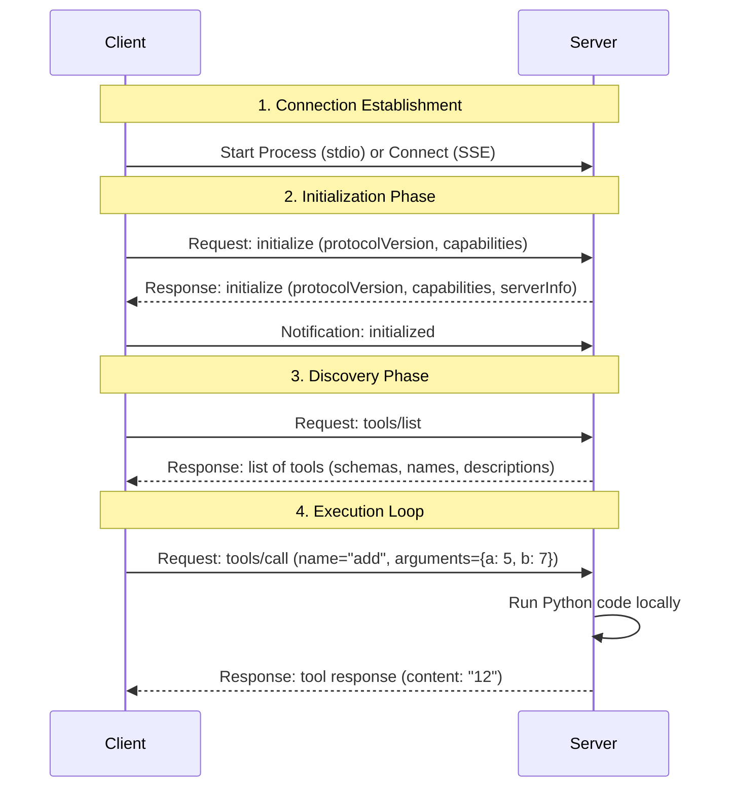

# The Ultimate Guide to Model Context Protocol (MCP)

Welcome to the comprehensive developer's guide to the **Model Context Protocol (MCP)**. This document is designed to take you from a complete beginner to an advanced practitioner capable of designing, building, and deploying production-ready MCP systems.

---

## Table of Contents
1. [Executive Summary & The "Why"](#1-executive-summary--the-why)
2. [Core Architecture: Host vs. Client vs. Server](#2-core-architecture-host-vs-client-vs-server)
3. [The Three Pillars of MCP](#3-the-three-pillars-of-mcp)
   - [Tools (Actions)](#tools-actions)
   - [Resources (Data Sources)](#resources-data-sources)
   - [Prompts (Templates)](#prompts-templates)
4. [Transport Layers: stdio vs. SSE](#4-transport-layers-stdio-vs-sse)
5. [Protocol Mechanics & Lifecycle](#5-protocol-mechanics--lifecycle)
6. [Security & Sandboxing Model](#6-security--sandboxing-model)
7. [Step-by-Step Implementation Guides](#7-step-by-step-implementation-guides)
   - [Building a Server with FastMCP](#building-a-server-with-fastmcp)
   - [Building a Client & LLM Integration Loop](#building-a-client--llm-integration-loop)
8. [Best Practices & Design Patterns](#8-best-practices--design-patterns)
9. [The MCP Ecosystem](#9-the-mcp-ecosystem)

---

## 1. Executive Summary & The "Why"

### The Problem: The N×M Integration Nightmare
Historically, connecting Large Language Models (LLMs) to external tools and data sources required bespoke integration layers. 
* If you had **N** different AI applications (Cursor, Claude Desktop, custom web apps) and **M** different data sources/tools (GitHub, Slack, Databases, Local Filesystem), you needed to write custom integration code **N × M** times.
* Developers had to manually translate raw APIs (REST, GraphQL, gRPC) into schemas the LLM could parse, handle authentication individually, and manage rate limits on a case-by-case basis.

### The Solution: MCP
The **Model Context Protocol (MCP)**, open-sourced by Anthropic, acts as an open standard (like USB-C for AI). It decouples the AI applications (Clients/Hosts) from the data sources and tools (Servers).

```mermaid
graph TD
    %% Without MCP
    subgraph Without MCP (N x M Complexity)
        App1[Claude Desktop] -->|Custom Code| API1[(Jira API)]
        App1 -->|Custom Code| API2[(GitHub API)]
        App2[Cursor] -->|Custom Code| API1
        App2 -->|Custom Code| API2
    end

    %% With MCP
    subgraph With MCP (Unified Standard)
        HostA[Claude Desktop] --> MCP_Client[MCP Client]
        HostB[Cursor] --> MCP_Client
        MCP_Client -->|Standard Protocol| Server1[Jira MCP Server]
        MCP_Client -->|Standard Protocol| Server2[GitHub MCP Server]
        Server1 --> API1
        Server2 --> API2
    end
```

By standardizing how capabilities are described and executed, any MCP-compliant AI client can immediately discover and use tools provided by any MCP-compliant server.

---

## 2. Core Architecture: Host vs. Client vs. Server

MCP divides responsibilities into three distinct roles:

```text
+-------------------------------------------------------+
|                       HOST                            |
|  (User Interface: Cursor, Claude Desktop, Custom UI)  |
|                                                       |
|  +-------------------------------------------------+  |
|  |                   CLIENT                        |  |
|  |  (Manages connections, calls tools, sessions)  |  |
|  +-------------------------------------------------+  |
+--------------------------|----------------------------+
                           |
                MCP Protocol (stdio/SSE)
                           |
+--------------------------v----------------------------+
|                     SERVER                            |
|  (Exposes Tools, Resources, and Prompt templates)     |
+-------------------------------------------------------+
```

### 1. The Host
The **Host** is the user-facing container application. It manages the user interface, renders chat inputs, and contains the core LLM execution engine.
* **Examples**: VS Code, Cursor, Claude Desktop, a command-line terminal, or a custom Django/React web application.

### 2. The Client
The **Client** is the engine inside the Host that implements the MCP specification. 
* It initiates connections to MCP servers.
* It parses tool/resource schemas returned by the servers.
* It translates LLM intents into protocol requests and returns the server's response back to the LLM.

### 3. The Server
The **Server** is a lightweight, specialized process or service that exposes specific capabilities (tools, data resources, or prompt templates) to the client.
* **Characteristics**: The server has no direct dependency on the LLM. It does not need to know which LLM (Gemini, Claude, GPT-4) is calling it; it simply implements standard interfaces to run code or fetch data.

---

## 3. The Three Pillars of MCP

MCP defines three primary primitives that a server can expose: **Tools**, **Resources**, and **Prompts**.

| Feature | Description | Initiator | Example Use Case |
| :--- | :--- | :--- | :--- |
| **Tools** | Executable actions that let the LLM modify state or run calculations. | LLM / Client | Writing a file, running a database query, sending an email. |
| **Resources** | Read-only data sources or contexts that feed information to the LLM. | Client / LLM | Reading a config file, exposing git diffs, tailing server logs. |
| **Prompts** | Pre-structured templates or workflows exposed to the user. | User / Host | "Review this code", "Debug this error", "Write a git commit message". |

---

### Tools (Actions)
Tools represent **executable code** that can change system state or perform operations.
* **Execution flow**:
  1. The server exposes the tool's schema (name, description, parameter types).
  2. The LLM decides to call the tool and generates the arguments.
  3. The client sends a `tools/call` request to the server.
  4. The server runs the actual function and returns the results (text, images, or files).

> [!IMPORTANT]
> **Docstrings and Type Hints Matter:** LLMs rely heavily on the description and parameter names to determine when a tool is relevant. A well-written docstring directly influences tool-selection accuracy.

---

### Resources (Data Sources)
Resources are **read-only pieces of data** that the server makes available to the client. They are identified by URIs.
* **Static Resources**: Hardcoded locations (e.g., `file:///etc/config.json`).
* **Dynamic Resource Templates**: Parametrized URIs (e.g., `database://{table}/schema`). The client can resolve these dynamically.
* **Mime Types**: Resources include MIME types (e.g., `text/plain`, `application/json`, `image/png`) to tell the client how to handle and display the data.

---

### Prompts (Templates)
Prompts are **reusable instructions or templates** that guide the LLM's behavior.
* A server can declare prompts that users can trigger inside the client UI.
* Prompts can accept arguments (e.g., a prompt called `refactor-code` taking a `language` argument).
* They allow servers to package recommended system prompts alongside the tools they provide.

---

## 4. Transport Layers: stdio vs. SSE

MCP supports multiple transport layers to handle communication between clients and servers.

### 1. `stdio` (Standard Input/Output)
Perfect for **local integration**. The client launches the server as a child process and communicates via `stdin` (Standard Input) and `stdout` (Standard Output).
* **Pros**: Simple, fast, secure (runs locally, no open ports), and requires no authentication configuration.
* **Cons**: Limited to the host machine; cannot span networks directly.

### 2. `SSE` (Server-Sent Events)
Designed for **remote or cloud integration**. The server runs as a web server (typically HTTP), and the client establishes an SSE connection.
* **Pros**: Can run in the cloud, supports multiple clients, and allows push updates from server to client.
* **Cons**: Requires web hosting, firewall configuration, network transport, and robust authentication (e.g., API keys, OAuth).

---

## 5. Protocol Mechanics & Lifecycle

MCP uses **JSON-RPC 2.0** as its messaging format. Communication consists of **Requests** (require a response), **Responses**, and **Notifications** (one-way messages).

### The Session Lifecycle



---

## 6. Security & Sandboxing Model

Because MCP servers can run arbitrary code (e.g., executing shell commands, reading/writing files, accessing databases), security is paramount.

### Security Principles:
1. **Local Sandboxing**: When using `stdio`, the server runs with the user's local system permissions. It is recommended to run servers in virtual environments (`venv`) or containers (Docker) if executing untrusted code.
2. **Client-in-the-Loop**: The client acts as a gatekeeper. When a server requests a dangerous action, the host UI should prompt the user for explicit approval (e.g., "Allow this tool to edit file `config.py`?").
3. **No Direct LLM Access to Servers**: The LLM *never* connects directly to an MCP server. It only sees schemas and produces JSON intents. The client executes the actual transport requests, acting as a firewall.

---

## 7. Step-by-Step Implementation Guides

### Building a Server with FastMCP
`FastMCP` is the modern Pythonic way to build MCP servers. It handles the JSON-RPC framing and schemas under the hood.

```python
# server.py
from mcp.server.fastmcp import FastMCP
import httpx

# Initialize the server
mcp = FastMCP("WeatherService")

# Expose a simple tool
@mcp.tool()
async def get_temperature(city: str) -> str:
    """
    Fetch the current temperature for a given city.
    
    Args:
        city: The name of the city (e.g., "Delhi", "New York")
    """
    # In a real application, you would call a REST API:
    # async with httpx.AsyncClient() as client:
    #     response = await client.get(f"https://api.weather.com/{city}")
    #     return response.json()["temp"]
    return f"The weather in {city} is 42°C"

if __name__ == "__main__":
    mcp.run()
```

---

### Building a Client & LLM Integration Loop
This demonstrates how a client establishes a session, launches the server process, exposes tools to Gemini, and executes them.

```python
# client.py
import asyncio
import os
from google import genai
from mcp import ClientSession, StdioServerParameters
from mcp.client.stdio import stdio_client
from dotenv import load_dotenv

load_dotenv()

class AISystem:
    def __init__(self):
        self.ai_client = genai.Client(api_key=os.getenv("GEMINI_API_KEY"))

    async def run_loop(self):
        # Configure the server to launch via stdio
        server_params = StdioServerParameters(
            command="python",
            args=["server.py"]
        )

        # Connect to the server
        async with stdio_client(server_params) as (read_stream, write_stream):
            async with ClientSession(read_stream, write_stream) as session:
                # Initialize the MCP session
                await session.initialize()

                # Discover the tools available on the server
                tools_response = await session.list_tools()
                print("Discovered tools:")
                for tool in tools_response.tools:
                    print(f"- {tool.name}: {tool.description}")

                # Simple REPL Loop
                while True:
                    user_query = input("\nAsk something (or type 'exit'): ")
                    if user_query.lower() == 'exit':
                        break

                    # 1. Ask Gemini to map the user request to a tool
                    # (Simplified prompt structure for demonstration)
                    prompt = (
                        f"User query: {user_query}\n"
                        f"Exposed tools: {[t.name for t in tools_response.tools]}\n"
                        "Decide which tool to use and extract arguments."
                    )
                    
                    # 2. Call the tool via the MCP session if requested
                    # In production, use standard tool-calling APIs provided by the LLM
                    # result = await session.call_tool("get_temperature", {"city": "Delhi"})
                    # print("Result:", result.content[0].text)

if __name__ == "__main__":
    asyncio.run(AISystem().run_loop())
```

---

## 8. Best Practices & Design Patterns

1. **Write Clean, Exhaustive Docstrings**: Docstrings are the only UI your LLM has. Specify parameter constraints, units (e.g., Celsius vs Fahrenheit), and return formats clearly.
2. **Validate Input Data**: Never trust LLM parameters. Validate types, structure, and sanitize inputs (e.g., using `pydantic`) before executing them on your server.
3. **Graceful Error Handling**: If a tool fails (e.g., database connection down), return a descriptive error text rather than raising raw stack traces. The LLM can read the error and try to correct its action.
4. **Use Asynchronous Handlers**: Use `async`/`await` for network requests or heavy I/O operations inside your MCP server to avoid blocking the transport loop.

---

## 9. The MCP Ecosystem

* **Official Specification**: Developed and maintained under [Model Context Protocol Github](https://github.com/modelcontextprotocol).
* **Pre-built Servers**: There is a growing list of community and official servers for Postgres, SQLite, Slack, Gmail, GitHub, Brave Search, and Google Drive.
* **The MCP Inspector**: A visual debugging tool (`npx @modelcontextprotocol/inspector`) to interactively test servers locally.
