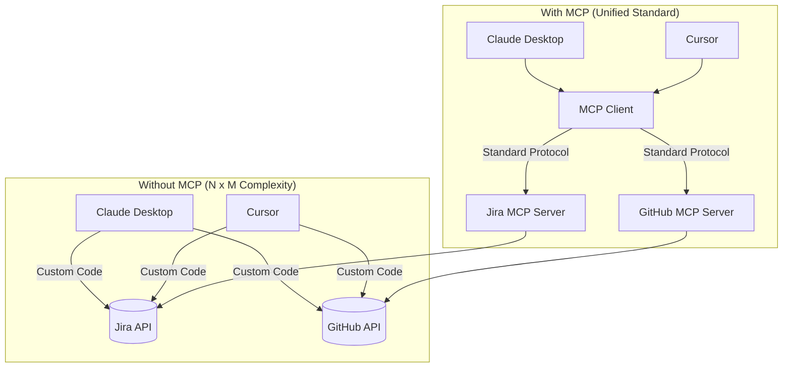
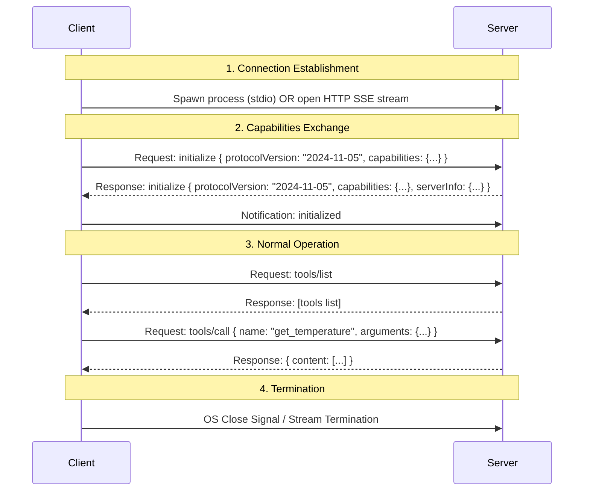

# The Ultimate Guide to Model Context Protocol (MCP)

Welcome to the comprehensive developer's guide and complete tutorial for the **Model Context Protocol (MCP)**. This document covers everything from core theory to low-level transport protocols (`stdio` vs. `SSE`), wire-level message formats, security models, and step-by-step practical implementations.

---

## Table of Contents
1. [Executive Summary & The "Why"](#1-executive-summary--the-why)
2. [Core Architecture: Host vs. Client vs. Server](#2-core-architecture-host-vs-client-vs-server)
3. [The Three Pillars of MCP](#3-the-three-pillars-of-mcp)
   - [Tools (Actions)](#tools-actions)
   - [Resources (Data Sources)](#resources-data-sources)
   - [Prompts (Templates)](#prompts-templates)
4. [Deep Dive: Transport Layers (stdio vs. SSE)](#4-deep-dive-transport-layers-stdio-vs-sse)
   - [stdio Protocol Plumbing](#stdio-protocol-plumbing)
   - [SSE Protocol Plumbing](#sse-protocol-plumbing)
   - [Comparison Matrix](#comparison-matrix)
5. [Wire Protocol: JSON-RPC 2.0 & Wire Formats](#5-wire-protocol-json-rpc-20--wire-formats)
6. [Session Lifecycle & Handshake Flow](#6-session-lifecycle--handshake-flow)
7. [Security & Sandboxing Model](#7-security--sandboxing-model)
8. [Step-by-Step Implementation Guides](#8-step-by-step-implementation-guides)
   - [Example 1: Building a stdio Server & Client](#example-1-building-a-stdio-server--client)
   - [Example 2: Building an SSE Server & Client](#example-2-building-an-sse-server--client)
9. [Debugging & Testing (MCP Inspector)](#9-debugging--testing-mcp-inspector)
10. [Best Practices & Design Patterns](#10-best-practices--design-patterns)

---

## 1. Executive Summary & The "Why"

### The Problem: The N×M Integration Nightmare
Historically, connecting Large Language Models (LLMs) to external tools and data sources required bespoke integration layers. 
* If you had **N** different AI applications (Cursor, Claude Desktop, custom web apps) and **M** different data sources/tools (GitHub, Slack, Databases, Local Filesystem), you needed to write custom integration code **N × M** times.
* Developers had to manually translate raw APIs (REST, GraphQL, gRPC) into schemas the LLM could parse, handle authentication individually, and manage rate limits on a case-by-case basis.

### The Solution: MCP
The **Model Context Protocol (MCP)**, open-sourced by Anthropic, acts as an open standard (like USB-C for AI). It decouples the AI applications (Clients/Hosts) from the data sources and tools (Servers).



By standardizing how capabilities are described and executed, any MCP-compliant AI client can immediately discover and use tools provided by any MCP-compliant server.

---

## 2. Core Architecture: Host vs. Client vs. Server

MCP divides responsibilities into three distinct roles:

```text
+-------------------------------------------------------+
|                       HOST                            |
|  (User Interface: Cursor, Claude Desktop, Custom UI)  |
|                                                       |
|  +-------------------------------------------------+  |
|  |                   CLIENT                        |  |
|  |  (Manages connections, calls tools, sessions)  |  |
|  +-------------------------------------------------+  |
+--------------------------|----------------------------+
                           |
                MCP Protocol (stdio/SSE)
                           |
+--------------------------v----------------------------+
|                     SERVER                            |
|  (Exposes Tools, Resources, and Prompt templates)     |
+-------------------------------------------------------+
```

### 1. The Host
The **Host** is the user-facing container application. It manages the user interface, renders chat inputs, and contains the core LLM execution engine.
* **Examples**: VS Code, Cursor, Claude Desktop, a command-line terminal, or a custom Django/React web application.

### 2. The Client
The **Client** is the engine inside the Host that implements the MCP specification. 
* It initiates connections to MCP servers.
* It parses tool/resource schemas returned by the servers.
* It translates LLM intents into protocol requests and returns the server's response back to the LLM.

### 3. The Server
The **Server** is a lightweight, specialized process or service that exposes specific capabilities (tools, data resources, or prompt templates) to the client.
* **Characteristics**: The server has no direct dependency on the LLM. It does not need to know which LLM (Gemini, Claude, GPT-4) is calling it; it simply implements standard interfaces to run code or fetch data.

---

## 3. The Three Pillars of MCP

MCP defines three primary primitives that a server can expose: **Tools**, **Resources**, and **Prompts**.

| Feature | Description | Initiator | Example Use Case |
| :--- | :--- | :--- | :--- |
| **Tools** | Executable actions that let the LLM modify state or run calculations. | LLM / Client | Writing a file, running a database query, sending an email. |
| **Resources** | Read-only data sources or contexts that feed information to the LLM. | Client / LLM | Reading a config file, exposing git diffs, tailing server logs. |
| **Prompts** | Pre-structured templates or workflows exposed to the user. | User / Host | "Review this code", "Debug this error", "Write a git commit message". |

---

### Tools (Actions)
Tools represent **executable code** that can change system state or perform operations.
* **Execution flow**:
  1. The server exposes the tool's schema (name, description, parameter types).
  2. The LLM decides to call the tool and generates the arguments.
  3. The client sends a `tools/call` request to the server.
  4. The server runs the actual function and returns the results (text, images, or files).

> [!IMPORTANT]
> **Docstrings and Type Hints Matter:** LLMs rely heavily on the description and parameter names to determine when a tool is relevant. A well-written docstring directly influences tool-selection accuracy.

---

### Resources (Data Sources)
Resources are **read-only pieces of data** that the server makes available to the client. They are identified by URIs.
* **Static Resources**: Hardcoded locations (e.g., `file:///etc/config.json`).
* **Dynamic Resource Templates**: Parametrized URIs (e.g., `database://{table}/schema`). The client can resolve these dynamically.
* **Mime Types**: Resources include MIME types (e.g., `text/plain`, `application/json`, `image/png`) to tell the client how to handle and display the data.

---

### Prompts (Templates)
Prompts are **reusable instructions or templates** that guide the LLM's behavior.
* A server can declare prompts that users can trigger inside the client UI.
* Prompts can accept arguments (e.g., a prompt called `refactor-code` taking a `language` argument).
* They allow servers to package recommended system prompts alongside the tools they provide.

---

## 4. Deep Dive: Transport Layers (stdio vs. SSE)

Transport determines how the serialized JSON-RPC 2.0 messages are physically framed and sent between the Client and Server. MCP supports two core transport modes out of the box.

---

### stdio Protocol Plumbing
The standard input/output (`stdio`) transport is designed for **co-located processes** running on the same machine. 

```text
+-----------------------+                    +-----------------------+
|      MCP Client       |                    |      MCP Server       |
|                       |                    | (Spawned Child Process|
|  +-----------------+  |                    |  +-----------------+  |
|  | Writing Process |=======(Standard Input)======> Reading Loop     |  |
|  +-----------------+  |                    |  +-----------------+  |
|                       |                    |                       |
|  +-----------------+  |                    |  +-----------------+  |
|  | Reading Loop    |<======(Standard Output)=====| Writing Process |  |
|  +-----------------+  |                    |  +-----------------+  |
|                       |                    |                       |
|  +-----------------+  |                    |  +-----------------+  |
|  | Log Handler     |<======(Standard Error)======| stderr Logging  |  |
|  +-----------------+  |                    |  +-----------------+  |
+-----------------------+                    +-----------------------+
```

#### Under the Hood:
1. **Process Lifecycle**: The Host process uses OS primitives (like `subprocess.Popen` in Python or `child_process.spawn` in Node.js) to start the MCP Server binary.
2. **Channel Separation**:
   * **`stdin` (Standard Input)**: The client writes JSON-RPC requests here. The server runs a continuous listening loop reading line-by-line.
   * **`stdout` (Standard Output)**: The server writes JSON-RPC responses here. The client reads from this stream.
   * **`stderr` (Standard Error)**: Reservably separate from the protocol channel. Anything printed to `stderr` by the server is intercepted by the client and logged for debugging (not parsed as JSON-RPC). This prevents simple runtime warnings or `print()` debug outputs from crashing the parser.

---

### SSE Protocol Plumbing
Server-Sent Events (`SSE`) is a standard HTTP transport designed for **networked and cloud-native** deployments.

Unlike standard HTTP (which is request-response only) or WebSockets (which are full-duplex TCP tunnels), SSE provides an **asymmetric, fire-and-forget channel layout**:

```text
+-----------------------+                            +-----------------------+
|      MCP Client       |                            |      MCP Server       |
|                       |                            |    (Web Service)      |
|  +-----------------+  |                            |  +-----------------+  |
|  | HTTP POST Client|=== (HTTP POST: Client Messages) => HTTP Endpoints  |  |
|  +-----------------+  |                            |  +-----------------+  |
|                       |                            |                       |
|  +-----------------+  |                            |  +-----------------+  |
|  | SSE Event Stream|<=== (Server-Sent Event Stream) ===| SSE Stream Engine |  |
|  +-----------------+  |                            |  +-----------------+  |
+-----------------------+                            +-----------------------+
```

#### Under the Hood:
1. **Handshake (SSE Setup)**:
   * The client initiates a standard HTTP `GET` request to the server's SSE endpoint (typically `/sse`).
   * The server responds with headers setting `Content-Type: text/event-stream` and `Cache-Control: no-cache`. It keeps this TCP socket open indefinitely.
2. **Server-to-Client Communication**:
   * The server pushes messages to the client down the open SSE stream. Each message is formatted with the prefix `data: ` followed by the JSON payload, followed by double newlines (`\n\n`).
3. **Client-to-Server Communication**:
   * Because SSE is strictly **unidirectional (server to client)**, the client cannot write messages back down the SSE channel.
   * Instead, the client transmits JSON-RPC requests to the server via standard **HTTP POST** requests to a dedicated endpoint (such as `/message` or as indicated by the server during the SSE handshake).

---

### Comparison Matrix

| Aspect | `stdio` Transport | `SSE` Transport |
| :--- | :--- | :--- |
| **Network Location** | Local (same machine) | Remote (across local networks or internet) |
| **Setup Cost** | Extremely low (single file or child process execution) | Medium (requires HTTP server framework, ports, domain names) |
| **Communication Type** | Bidirectional process streams (`stdin`/`stdout`) | Asymmetric HTTP (unidirectional SSE stream + HTTP POST requests) |
| **Ports & Binding** | No ports required (safest for local use) | Binds to an HTTP port (e.g. `8000`) |
| **Concurrency** | 1 Host to 1 Server process | Multiple Clients can connect to 1 remote server |
| **Debugging** | Easy (directly pipe stdin/stdout) | Harder (requires monitoring HTTP packages and streams) |
| **Best Used For** | Desktop environments (e.g., Cursor, Claude Desktop) | Multi-tenant services, cloud database engines, hosted APIs |

---

## 5. Wire Protocol: JSON-RPC 2.0 & Wire Formats

All communication over MCP transports conforms to the **JSON-RPC 2.0 specification**.

### 1. Request Frame (Client to Server)
Sent when the client wants to execute a command (e.g., listing tools).
```json
{
  "jsonrpc": "2.0",
  "id": 1,
  "method": "tools/list",
  "params": {}
}
```

### 2. Response Frame (Server to Client)
Sent by the server to return the result of a request.
```json
{
  "jsonrpc": "2.0",
  "id": 1,
  "result": {
    "tools": [
      {
        "name": "get_temperature",
        "description": "Fetch the current temperature for a given city.",
        "inputSchema": {
          "type": "object",
          "properties": {
            "city": {
              "type": "string"
            }
          },
          "required": ["city"]
        }
      }
    ]
  }
}
```

### 3. Notification Frame (One-Way)
Used for asynchronous events that do not expect a response.
```json
{
  "jsonrpc": "2.0",
  "method": "notifications/resources/list_changed"
}
```

---

## 6. Session Lifecycle & Handshake Flow

Before tools can be executed, the client and server must complete an initialization handshake.



---

## 7. Security & Sandboxing Model

Because MCP servers execute local code and access data, they represent a significant security surface area.

### Core Security Policies:
1. **Client Isolation**: The AI model (LLM) does not speak to the server. The client intercepts the model's intents, runs authorization checks, and then executes the code.
2. **Credential Management**: Servers should never contain hardcoded API keys. They should receive secrets dynamically via environment variables (`.env`) passed down by the client during process initialization.
3. **Execution Sandboxing**: For untrusted tools, execute within isolated Docker containers or WebAssembly runtimes rather than host environments.

---

## 8. Step-by-Step Implementation Guides & Code Explanations

Here we break down two working examples using **stdio** and **SSE** transport layers.

---

### Example 1: Building a stdio Server & Client

This is a local, process-to-process architecture.

#### 1. The Server (`server_stdio.py`)
```python
from mcp.server.fastmcp import FastMCP

mcp = FastMCP("MathServer")

@mcp.tool()
def add_numbers(x: float, y: float) -> float:
    """
    Adds two floating point numbers and returns the sum.
    
    Args:
        x: First number
        y: Second number
    """
    return x + y

if __name__ == "__main__":
    mcp.run(transport="stdio")
```

##### Code Explanation:
* **`from mcp.server.fastmcp import FastMCP`**: Imports the official high-level FastMCP helper designed to minimize boilerplate.
* **`mcp = FastMCP("MathServer")`**: Instantiates the server object and names it `"MathServer"`. This name is sent to the client during the protocol handshake.
* **`@mcp.tool()`**: A decorator that automatically registers the python function below it as an MCP tool. It generates the matching JSON schema dynamically.
* **Type Hints (`x: float, y: float) -> float`**: FastMCP inspects these type annotations to construct the schema constraints (e.g., specifying that parameter `x` must be a number).
* **Docstring (`Adds two...`)**: The docstrings and the `Args:` descriptions are parsed and sent to the client. The LLM reads these descriptions to determine which tool is suitable for a task.
* **`mcp.run(transport="stdio")`**: Tells the server process to start and begin listening on Standard Input (`stdin`) and writing back responses on Standard Output (`stdout`).

---

#### 2. The Client (`client_stdio.py`)
```python
import asyncio
from mcp import ClientSession, StdioServerParameters
from mcp.client.stdio import stdio_client

async def run_client():
    # Define connection parameters for local execution
    server_params = StdioServerParameters(
        command="python",
        args=["server_stdio.py"]
    )

    async with stdio_client(server_params) as (read_stream, write_stream):
        async with ClientSession(read_stream, write_stream) as session:
            # Complete the protocol handshake
            await session.initialize()
            
            # List tools
            tools_response = await session.list_tools()
            print("Available tools:", [tool.name for tool in tools_response.tools])
            
            # Call a tool
            result = await session.call_tool("add_numbers", {"x": 10.5, "y": 4.5})
            print("Output of add_numbers(10.5, 4.5):", result.content[0].text)

if __name__ == "__main__":
    asyncio.run(run_client())
```

##### Code Explanation:
* **`StdioServerParameters(...)`**: Configures how to launch the server. It specifies the executable (`python`) and the relative path arguments to the server script (`server_stdio.py`).
* **`async with stdio_client(server_params)`**: A context manager that launches the server process in the background, exposing native async read and write streams tied to the child process's stdout and stdin.
* **`ClientSession(read_stream, write_stream)`**: Starts the JSON-RPC session loop over these streams to manage concurrent requests and responses.
* **`await session.initialize()`**: Executes the mandatory initialization handshake. The client and server agree on protocol versions and exchange capabilities.
* **`await session.list_tools()`**: Sends a `tools/list` request to discover the tools exposed by the server.
* **`await session.call_tool("add_numbers", ...)`**: Invokes the `add_numbers` function on the server. The client packs the argument values into a JSON-RPC payload, sends it to the server, and retrieves the text result from `result.content[0].text`.

---

### Example 2: Building an SSE Server & Client

This architecture runs the server as a network-accessible HTTP web service.

#### 1. The Server (`server_sse.py`)
*To run this server, install uvicorn and starlette:* `pip install starlette uvicorn`

```python
from mcp.server.fastmcp import FastMCP

mcp = FastMCP("SSEServer")

@mcp.tool()
def get_system_status() -> str:
    """Check the health status of the remote server."""
    return "All systems operational (SSE)"

if __name__ == "__main__":
    # Runs an HTTP web service exposing SSE transport endpoints
    mcp.run(transport="sse")
```

##### Code Explanation:
* **`mcp.run(transport="sse")`**: Instead of listening on stdio, FastMCP spins up an ASGI web application (using FastAPI/Starlette) running on port `8000` by default.
* The tool definition remains exactly the same. The transport mechanism is decoupled from your business logic.

---

#### 2. The Client (`client_sse.py`)
```python
import asyncio
from mcp import ClientSession
from mcp.client.sse import sse_client

async def run_sse_client():
    # Connect to the running SSE server endpoint
    server_url = "http://localhost:8000/sse"
    
    async with sse_client(server_url) as (read_stream, write_stream):
        async with ClientSession(read_stream, write_stream) as session:
            # Perform protocol handshake
            await session.initialize()
            
            # List tools
            tools_response = await session.list_tools()
            print("SSE Server Tools:", [tool.name for tool in tools_response.tools])
            
            # Call tool
            result = await session.call_tool("get_system_status")
            print("Server response:", result.content[0].text)

if __name__ == "__main__":
    asyncio.run(run_sse_client())
```

##### Code Explanation:
* **`sse_client(server_url)`**: Connects to the HTTP server at the specified `/sse` endpoint. It keeps a persistent GET request open for reading messages (SSE stream) and uses HTTP POST requests under the hood to send messages.
* **Protocol-Agnostic Code**: Notice how `session.initialize()`, `session.list_tools()`, and `session.call_tool()` are **identical** to the stdio client code. Once the transport streams are established, the application layer does not care whether communication is happening over local OS pipes or the Internet.

---

## 9. Debugging & Testing (MCP Inspector)

The **MCP Inspector** is a powerful GUI debugging tool provided by the developers of MCP. It allows you to visualize communication, inspect tool schemas, and invoke methods manually.

```bash
# Debug a local stdio python server
npx @modelcontextprotocol/inspector python server_stdio.py
```

It launches a local web application (usually at `http://localhost:5173`) where you can interactively test your tools and resources.

---

## 10. Best Practices & Design Patterns

1. **Design Narrow APIs**: Do not create generic tools like `run_code()`. Keep tools specific (e.g., `update_database_row()`) so the model makes fewer planning errors.
2. **Handle Large Payloads Gracefully**: When returning large amounts of data, prefer sending them as **Resources** rather than large tool outputs. LLMs read resources with dedicated intent, optimizing context window usage.
3. **Use Structural Validation**: Leverage type safety (`Pydantic` models) on server endpoints to enforce structural boundaries between LLM predictions and machine execution.
4. **Log to Stderr**: When building a `stdio` server, always use `sys.stderr` or standard python `logging` (which prints to stderr) for console outputs. Standard `print()` goes to `stdout` and will corrupt the JSON-RPC parsing pipeline.
